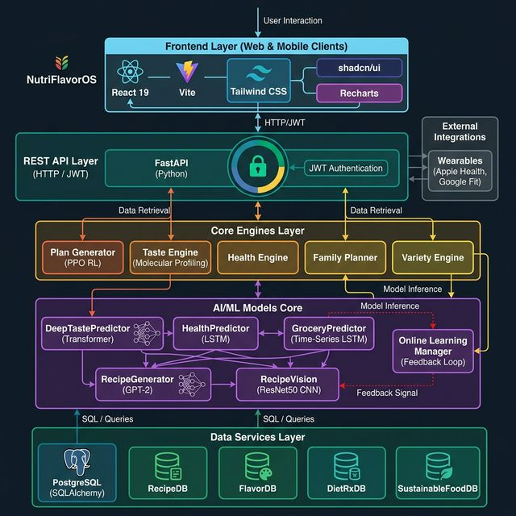

# FoodScope - Intelligent Nutrition & Sustainability Platform

FoodScope is a next-generation food tracking and meal planning application that integrates Personalization, Sustainability, and Health into a unified experience.

## 🚀 Key Features

### 🥗 Smart Meal Planning
- **AI-Powered Generation**: Generates 7-day meal plans based on your taste profile and health goals.
- **RecipeDB Integration**: Access to 118,000+ recipes with detailed macro/micronutrient data.
- **Dynamic Swapping**: Instantly swap meals while maintaining nutritional balance.

### 🎮 Gamification & Social
- **Leaderboards**: Compete with friends on Carbon Saved, Health Score, and Variety.
- **Achievements**: Unlock badges for milestones (e.g., "Green Eater", "Streak Master").
- **Taste Profiling**: Visualize your flavor preferences with the interactive Radar Chart.

### 🌍 Sustainability Tracking
- **Carbon Footprint**: Real-time tracking of your diet's environmental impact.
- **Eco-Recommendations**: Smart suggestions to reduce your footprint (e.g., "Try a meatless Monday").

### 🛒 Smart Grocery
- **Auto-Generated Lists**: Shopping lists created automatically from your meal plan.
- **Inventory Tracking**: Track what you have at home to reduce waste.

## 🏗️ System Architecture



## 🛠️ Technology Stack

- **Frontend**: React 19, Vite, Tailwind CSS, Framer Motion, Recharts
- **Backend**: FastAPI (Python), PyTorch (ML), Pandas, NumPy
- **Data Services**: RecipeDB, FlavorDB, DietRxDB, SustainableFoodDB

## 📦 Installation & Setup

### Prerequisites
- Node.js (v18+)
- Python (v3.10+)

### 1. Backend Setup
```bash
cd backend
python -m venv venv
.\venv\Scripts\activate
pip install -r requirements.txt
# Environment variables setup in backend/.env
```

### 2. Frontend Setup
```bash
cd frontend
npm install
```

## 🏃‍♂️ Running the Platform

### 🚀 Recommended: One-Command Launch
Run the master launch script from the project root. This handles DB verification, ML model status, and starts the stack:
```bash
python scripts/launch_system.py
```

### 🧠 ML Model Training
To train the neural networks with Early Stopping (patience=10, max epochs=10k):
```bash
python scripts/train_all_models.py
```

### Manual Start
**Backend:**
```bash
python -m backend.main
```

**Frontend:**
```bash
cd frontend
npm run dev
```

Visit `http://localhost:5173` to use the app!

## 🧪 Integration Verification
Verify the full API flow (Auth, Meals, Grocery, Analytics):
```bash
python scripts/verify_frontend_api.py
```

## 🤝 APIs & Credits
This project leverages the CosyLab suite of databases:
- **RecipeDB**: Recipe data and nutrition.
- **FlavorDB**: Molecular flavor analysis.
- **DietRxDB**: Health condition and nutrition interactions.
