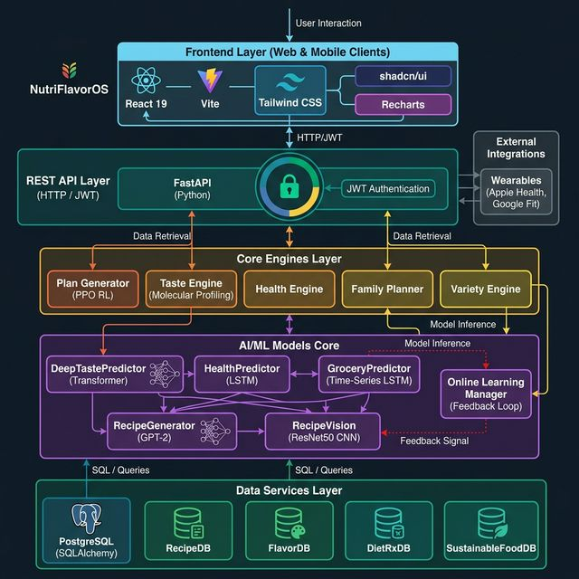

# NutriFlavorOS

NutriFlavorOS is an **experimental meal-planning, household-food-state, and food-research platform**. It explores personalized planning, recipe discovery, quantity-aware grocery support, pantry and leftover workflows, reproducible offline experiments, and sustainability-oriented interfaces.

> **Safety status:** this repository is not clinically validated, is not a medical device, and must not be used to diagnose, treat, or autonomously manage allergies, diseases, medication interactions, food safety, or health outcomes. Experimental ML components remain disabled until validated data, evaluations, versioned artifacts, and the declared promotion gates exist.

## Implemented foundations

### Identity, persistence, and safety

- Password-hashed accounts, signed bearer tokens, and self-only authorization for user-owned resources.
- SQLAlchemy persistence with versioned Alembic migrations for fresh and legacy databases.
- Explicit failures instead of silent demo-data, random-model, or unsafe recipe fallbacks.
- Append-only feedback and inventory events.
- Structured API contracts, plan schema versions, provenance fields, and explicit data-status warnings.

### Quantity-aware planning

- Deterministic horizon-level meal planning rather than independent greedy slot selection.
- Joint portion, calorie, protein, carbohydrate, fat, taste, cost, cuisine, ingredient-variety, and repeat objectives.
- Hard dietary and allergen filtering before optimization.
- Structured infeasibility diagnostics and disclosed relaxation of non-safety variety preferences.
- Conservative ingredient parsing that preserves ranges and converts only dimensionally compatible units.
- Serving-scaled shopping aggregation with normalized, mixed-unit, and unquantified statuses.

### Household inventory and leftovers

- User-owned households and household-member planning constraints.
- Transactional pantry lots with quantity intervals, expiry timestamps, source metadata, and optimistic versions.
- Idempotent purchase, consume, adjust, and discard events.
- Leftover creation and consumption with source-recipe and source-plan checks.
- Expired-stock exclusion and near-expiry annotations.
- Conservative shopping-list subtraction using pantry uncertainty intervals.
- Deterministic batch-preparation grouping for repeated recipes.

See [Household Inventory, Leftovers and Batch Preparation](docs/HOUSEHOLD_INVENTORY.md).

### Research and experimentation

The versioned research catalog defines:

- 28 tasks;
- 24 dataset families;
- 57 model and algorithm families;
- 21 experiment contracts;
- 26 feature contracts.

Implemented research infrastructure includes:

- deterministic TF-IDF retrieval, popularity/content recommendation, moving-average, Croston, and ridge-regression baselines;
- retrieval, forecasting, regression, calibration, segmentation, uncertainty, and offline-policy metrics;
- deterministic group-aware and temporal dataset splits;
- versioned dataset and model cards;
- SHA-256 artifact integrity checks;
- registered, candidate, champion, archived, and rejected model stages;
- risk-dependent promotion gates that block unvalidated high-risk and clinical-risk deployment;
- numerical and categorical drift diagnostics;
- reproducible offline manifests, fingerprints, seeds, artifacts, and environment snapshots;
- explicit USDA FoodData Central adapter with no silent missing-value or mock fallback;
- rule-based culinary substitution baseline with hard restriction filtering.

See [Research Platform](docs/RESEARCH_PLATFORM.md).

## Experimental or incomplete

- Medical-condition, medication, allergy, storage-duration, and health guidance are not clinically validated.
- Micronutrients are not hard optimization constraints until quantity-normalized nutrient provenance is sufficiently complete.
- Sustainability remains disabled by default because geography, production method, source provenance, functional units, and uncertainty are incomplete.
- Household invitations, member-specific nutritional optimization, verified shelf-life policies, appliance capacity, and stock reservations remain future work.
- Vision, multimodal nutrition estimation, recipe generation, contextual bandits, continual personalization, causal analyses, and online learning are catalogued but remain disabled until their data and validation gates pass.
- Social and achievement surfaces remain disabled until backed by transactional data.
- Obsolete duplicate frontend code and several hardcoded or accessibility-deficient UI surfaces still require removal.

## Architecture



- **Frontend:** React, TypeScript, Vite, Tailwind CSS, Framer Motion, Recharts.
- **Backend:** FastAPI, Pydantic, SQLAlchemy, Alembic.
- **Optimization:** deterministic bounded beam search over the complete planning horizon.
- **Household domain:** transactional inventory, leftovers, audit events, and versioned writes.
- **Research:** catalog, baselines, evaluation, splits, cards, registry, drift, and offline manifests.
- **Optional research stack:** PyTorch and Transformers modules under `backend/ml/`; these are not evidence of trained or validated behavior.
- **Persistence:** SQLite for local development; PostgreSQL is recommended for deployment.

## Local setup

```bash
cp .env.example .env
# Replace SECRET_KEY with a securely generated random value.
python -m venv .venv
source .venv/bin/activate        # Linux/macOS
# .venv\Scripts\activate         # Windows PowerShell
pip install -r backend/requirements.txt
alembic upgrade head
uvicorn backend.main:app --reload --host 0.0.0.0 --port 8000
```

In a separate terminal:

```bash
cd frontend
npm ci
npm run dev
```

Open `http://localhost:5173`.

## Data-quality and ingredient backfill

Dry-run first:

```bash
python scripts/backfill_recipe_ingredients.py
```

After reviewing `reports/recipe_data_quality.json`:

```bash
python scripts/backfill_recipe_ingredients.py --apply
```

This populates canonical ingredient structures. It does not automatically rewrite calories or macros because serving basis and source provenance must be reviewed.

## Offline experiments

Validate the catalog or run a whitelisted baseline:

```bash
python scripts/run_offline_experiment.py --config experiment.json
```

Manage versioned artifacts:

```bash
python scripts/manage_artifact_registry.py register-dataset usda_fdc_foundation 2026-04
python scripts/manage_artifact_registry.py register-model tfidf_retriever 1.0 reports/model.bin
python scripts/manage_artifact_registry.py verify model tfidf_retriever 1.0
```

The API validates experiment configurations and exposes catalog/cards/drift diagnostics, but deliberately does not execute arbitrary experiment code.

## USDA FoodData Central

Set both:

```bash
ENABLE_FOODDATA_CENTRAL=true
FOODDATA_CENTRAL_API_KEY=your-key
```

The adapter preserves source identifiers and missing values and marks imported mappings as externally sourced but not independently verified.

## Container build

```bash
docker build -t nutriflavos .
docker volume create nutriflavos-data

docker run --rm \
  -v nutriflavos-data:/app/data \
  -e DATABASE_URL="sqlite:////app/data/nutriflavor.db" \
  nutriflavos alembic upgrade head

docker run --rm -p 8000:8000 \
  -v nutriflavos-data:/app/data \
  -e SECRET_KEY="$(python -c 'import secrets; print(secrets.token_urlsafe(48))')" \
  -e DATABASE_URL="sqlite:////app/data/nutriflavor.db" \
  -e AUTO_CREATE_SCHEMA=false \
  nutriflavos
```

The migration and application containers must share the same volume. PostgreSQL is recommended for hosted or multi-replica deployments.

## Validation

```bash
pytest backend/tests
cd frontend && npm test && npm run lint && npm run build
```

A successful import, synthetic training run, shape check, or catalog entry is not evidence of accuracy or safety. New model claims require dataset provenance, leakage-safe splits, reproducibility, calibrated uncertainty, subgroup and OOD evaluation appropriate to risk, a versioned artifact, and a rollback path.

## Next priorities

1. Run full repository and container validation in a normal checkout and add repository-native CI.
2. Remove obsolete duplicate frontend code, unsafe rich-text rendering, hardcoded dashboards, and accessibility defects.
3. Add accepted household invitations, roles, member-specific planning, verified densities/package sizes, storage policies, and stock reservation.
4. Add pantry-aware optimization rather than only post-plan shopping reconciliation.
5. Replace remaining JSON/pickle stores and purge historical committed runtime artifacts.
6. Implement additional catalogued datasets and models only through the card, split, evaluation, integrity, and promotion-gate pipeline.
7. Benchmark CP-SAT/MILP and Pareto planners against the deterministic beam-search baseline when canonical data coverage is sufficient.
